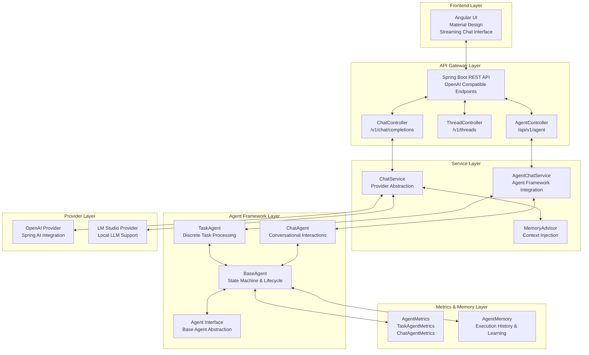
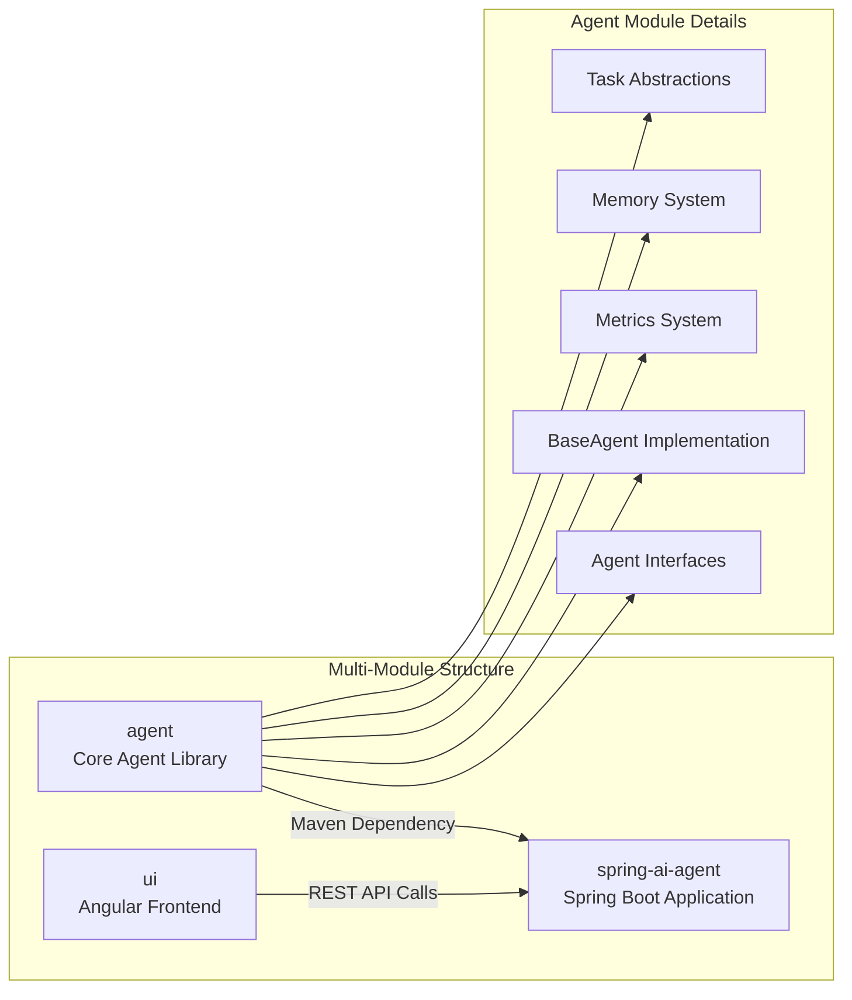
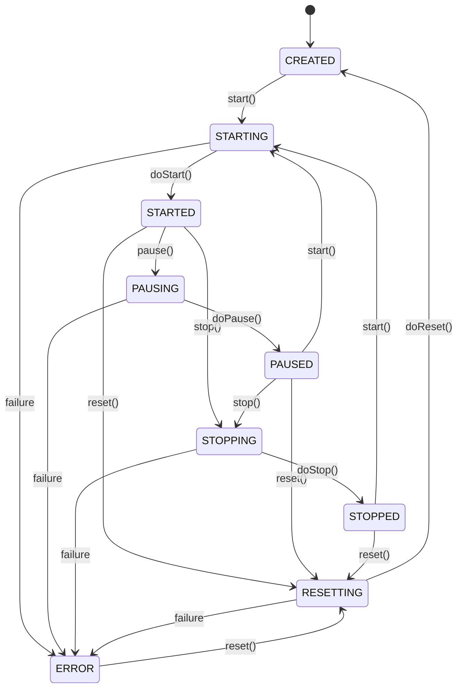
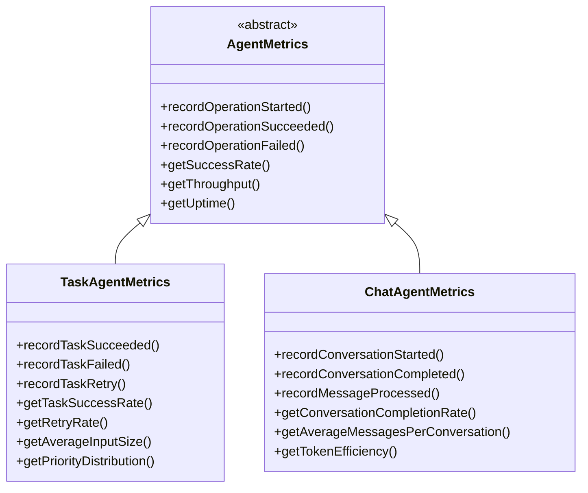
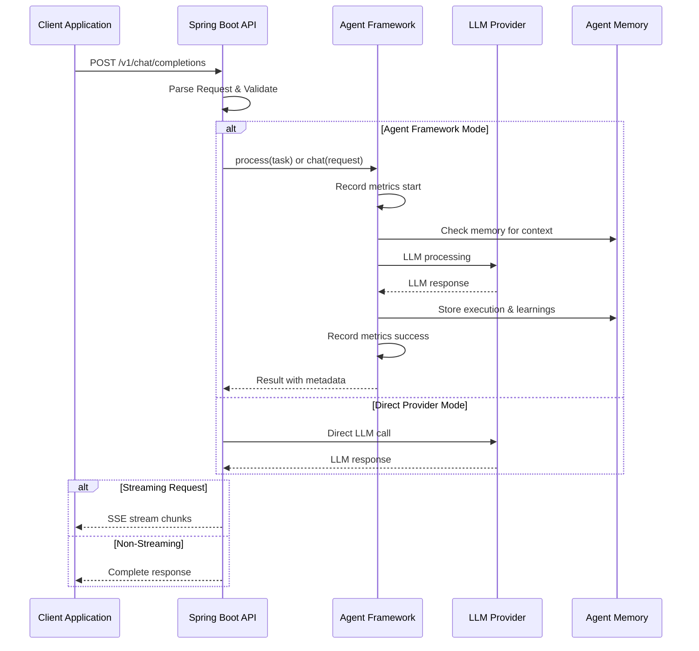
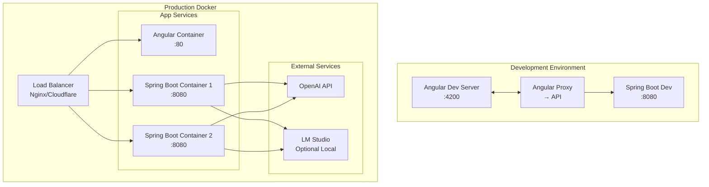

# Spring AI Agent Project

A multi-module project providing unified OpenAI-compatible chat completions API with streaming support, multiple LLM providers, and modern Angular UI.

## 🚀 Features

- **Unified API**: Single `/v1/chat/completions` endpoint for streaming and non-streaming
- **OpenAI Integration**: Full OpenAI API compatibility with gpt-5-nano and gpt-4 models
- **Streaming Support**: Real-time Server-Sent Events (SSE) streaming
- **Thread Management**: OpenAI Assistants API-compatible conversation threads
- **Modern UI**: Angular Material Design interface with streaming toggle
- **OpenAI Compatible**: Drop-in replacement for OpenAI Chat Completions API
- **Agent Framework**: Extensible agent architecture with task and chat specializations

## 🏗️ Architecture Overview



## 📋 Module Architecture



## 🔄 Agent State Machine



## 📊 Metrics Hierarchy



## 🎯 Agent Specialization Patterns

```mermaid
graph TB
    subgraph "Agent Hierarchy"
        Base[Agent Interface<br/>Generic Operations]

        subgraph "Specialized Agents"
            Task[TaskAgent<br/>Process(TASK) → RESULT]
            Chat[ChatAgent<br/>Chat(REQUEST) → RESPONSE]
            AI[AiAgent<br/>Transform Pipeline]
        end

        subgraph "Implementation"
            Impl[BaseAgent<br/>State Machine<br/>Single-threaded<br/>Metrics & Memory]
        end
    end

    Base <|-- Task
    Base <|-- Chat
    Base <|-- AI

    Task <|-- Impl
    Chat <|-- Impl
    AI <|-- Impl

    subgraph "Use Cases"
        UC1[Data Processing<br/>Document Analysis<br/>Code Generation]
        UC2[Customer Service<br/>Personal Assistants<br/>Tutors]
        UC3[LLM Integration<br/>Content Generation<br/>Analysis]
    end

    Task --> UC1
    Chat --> UC2
    AI --> UC3
```

## 🌐 API Request Flow



## 🚀 Deployment Architecture



## 📁 Project Structure

```
spring-ai-agent/
├── README.md              # Main project overview
├── docker-compose.yml     # Docker configuration
├── run-dev.bat           # Development launcher (Windows)
├── pom.xml               # Maven configuration
│
├── agent/                # 🤖 Agent library
│   ├── src/main/java/ai/demo/agent/
│   │   ├── base/                   # Base abstractions
│   │   │   ├── Agent.java              # Base agent interface
│   │   │   ├── AiAgent.java            # AI/LLM specialization
│   │   │   ├── BaseAgent.java          # Abstract implementation
│   │   │   ├── AgentConfiguration.java # Configuration management
│   │   │   ├── AgentException.java     # Exception handling
│   │   │   ├── AgentMemory.java        # Memory system
│   │   │   ├── AgentState.java         # State enumeration
│   │   │   └── task/                   # Task abstractions
│   │   ├── chat/                   # Chat agent specialization
│   │   │   └── ChatAgent.java         # Conversational agent interface
│   │   ├── task/                   # Task agent specialization
│   │   │   └── TaskAgent.java         # Discrete task processing interface
│   │   └── metrics/                # Performance metrics
│   │       ├── AgentMetrics.java       # Base metrics class
│   │       ├── TaskAgentMetrics.java   # Task-specific metrics
│   │       └── ChatAgentMetrics.java   # Chat-specific metrics
│   └── src/test/java/              # Agent tests
│
├── spring-ai-agent/     # 🌐 Spring Boot application
│   ├── src/main/java/ai/demo/springagent/
│   │   ├── controller/             # REST controllers
│   │   │   ├── ChatController.java
│   │   │   ├── ThreadController.java
│   │   │   └── AgentController.java
│   │   ├── service/                # Business logic
│   │   │   ├── ChatService.java
│   │   │   └── AgentChatService.java
│   │   ├── provider/               # LLM providers
│   │   └── config/                 # Configuration
│   └── src/test/                   # Integration tests
│
├── ui/                  # 🎨 Angular frontend
│   ├── src/app/
│   │   ├── services/               # API services
│   │   ├── components/             # UI components
│   │   └── models/                 # TypeScript interfaces
│   └── src/test/                   # Frontend tests
│
├── docs/                # 📚 Documentation
│   ├── README.md          # Documentation index
│   ├── ARCHITECTURE.md    # System architecture
│   ├── API_USAGE.md       # API documentation
│   ├── AGENTS.md          # Agent framework guide
│   ├── PROJECT_STATUS.md  # Project status
│   ├── TODO.md            # Project roadmap
│   └── ...other docs
│
├── scripts/             # 🚀 Development scripts
│   ├── run-dev.sh        # Development launcher (Linux/macOS)
│   ├── run-dev.bat       # Development launcher (Windows)
│   ├── start.sh          # Service starter (Linux/macOS)
│   └── start.bat         # Service starter (Windows)
│
├── tools/               # 🔧 Development tools
│   ├── mock-servers/     # Mock servers for testing
│   │   ├── mock-server.js
│   │   └── simple-mock-server.js
│   └── testing/          # Testing utilities
│       └── test-agent-integration.js
│
└── config/              # ⚙️ Configuration files
    ├── vscode/           # VSCode settings
    ├── claude/           # Claude Code settings
    └── env/              # Environment templates
```

## Quick Start with Docker

1. **Clone and setup environment**:
   ```bash
   cp .env.example .env
   # Edit .env and add your OpenAI API key
   ```

2. **Start all services**:
   ```bash
   docker-compose up -d
   ```

3. **Access the application**:
   - **Chat UI**: http://localhost:4200 (with streaming toggle and provider selection)
   - **API**: http://localhost:8080/v1 (OpenAI-compatible endpoints)
   - **Health Check**: http://localhost:8080/actuator/health
   - **API Docs**: See [API_USAGE.md](./API_USAGE.md)

## Development Setup

### Prerequisites
- Java 21
- Maven 3.9+
- Node.js 18+
- Docker & Docker Compose (for production deployment)

### Quick Development Start
```bash
# Linux/macOS
./scripts/run-dev.sh

# Windows
run-dev.bat
```

## 🔌 API Endpoints

### Chat Completions
- `POST /v1/chat/completions` - Unified chat completions (streaming/non-streaming)
  - Query params: `stream=true/false`
  - Headers: `X-LLM-Provider: openai`

### Agent Framework
- `POST /api/v1/agent/chat` - Chat via agent framework
- `POST /api/v1/agent/chat/memory` - Chat with memory context
- `GET /api/v1/agent/metrics` - Agent performance metrics
- `GET /api/v1/agent/health` - Agent health status
- `POST /api/v1/agent/memory/compact` - Compact agent memory
- `GET /api/v1/agent/capabilities` - Agent capabilities

### Thread Management
- `POST /v1/threads` - Create conversation thread
- `GET /v1/threads/{id}` - Get thread details
- `GET /v1/threads/{id}/messages` - List thread messages
- `POST /v1/threads/{id}/messages` - Add message to thread

### System
- `GET /v1/models` - Available models
- `GET /actuator/health` - Health check

## 📖 Documentation

- [API Usage Guide](./API_USAGE.md) - Comprehensive API documentation with examples
- [Agent Development Guide](./AGENTS.md) - Agent framework development guidelines
- [Deployment Guide](./docs/deployment-guide.md) - Docker, container registry, and Kubernetes instructions
- [Troubleshooting Guide](./docs/troubleshooting.md) - Common fixes for backend, UI, and deployment issues
- [TODO List](./TODO.md) - Project roadmap and task tracking
- [CLAUDE.md](./CLAUDE.md) - Development setup and build instructions

## 🤝 Contributing

Refer to [TODO.md](./TODO.md) for current tasks and roadmap. New tasks can be assigned using the standard format provided in the TODO file.
