# Architecture Documentation

This document provides detailed architectural diagrams and design patterns for the Spring AI Agent project.

## Table of Contents
1. [System Architecture](#system-architecture)
2. [Agent Framework Design](#agent-framework-design)
3. [Data Flow Patterns](#data-flow-patterns)
4. [Component Interactions](#component-interactions)
5. [Deployment Patterns](#deployment-patterns)
6. [Performance Considerations](#performance-considerations)

## System Architecture

### High-Level System View

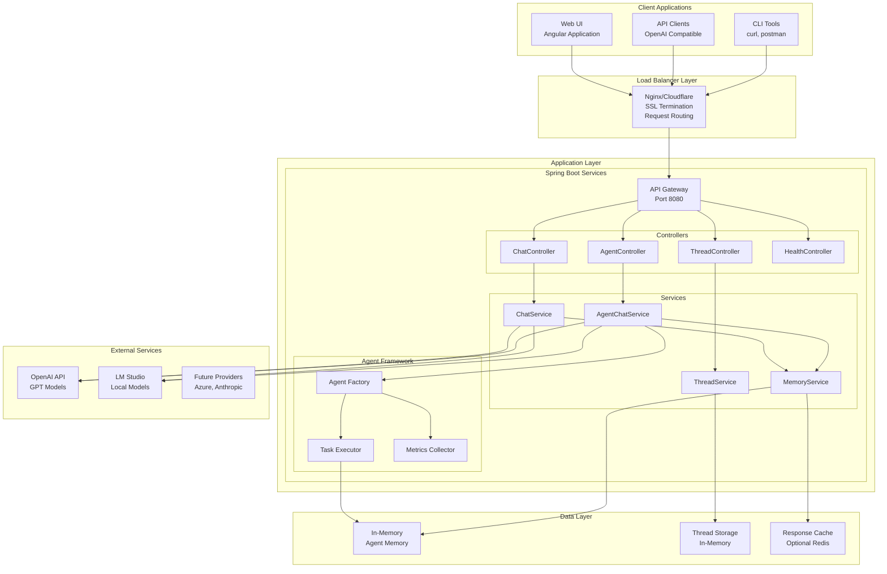

## Agent Framework Design

### Agent Interface Hierarchy

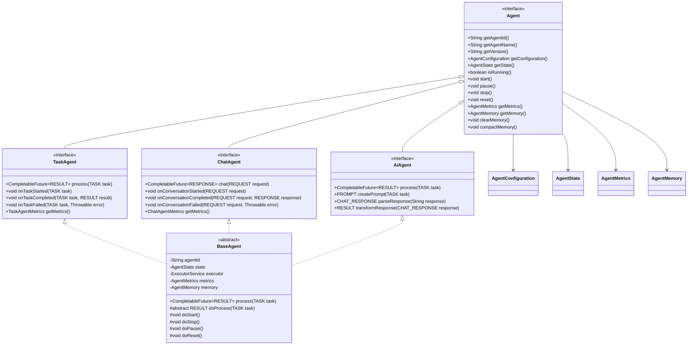

### Agent State Machine Implementation

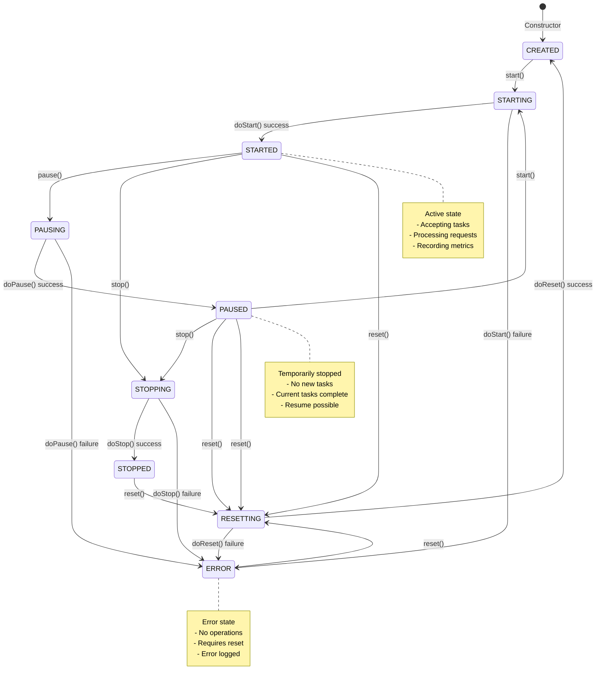

## Data Flow Patterns

### Request Processing Flow

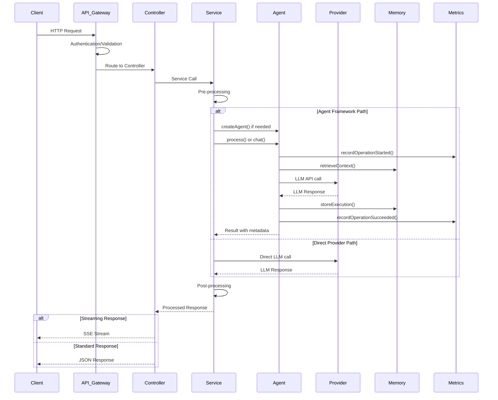

### Agent Memory Management Flow

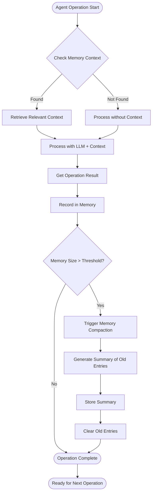

## Component Interactions

### Spring Boot Component Architecture

```mermaid
graph TB
    subgraph "Presentation Layer"
        subgraph "REST Controllers"
            ChatController[ChatController<br/>/v1/chat/completions]
            ThreadController[ThreadController<br/>/v1/threads]
            AgentController[AgentController<br/>/api/v1/agent]
            ModelController[ModelController<br/>/v1/models]
            HealthController[HealthController<br/>/actuator/health]
        end

        subgraph "Request/Response DTOs"
            ChatRequest[ChatRequest]
            ChatResponse[ChatResponse]
            ThreadDTO[ThreadDTO]
            MessageDTO[MessageDTO]
            MetricsDTO[MetricsDTO]
        end
    end

    subgraph "Business Logic Layer"
        subgraph "Services"
            ChatService[ChatService<br/>OpenAI Integration]
            ThreadService[ThreadService<br/>Conversation Management]
            AgentChatService[AgentChatService<br/>Agent Framework]
            MemoryService[MemoryService<br/>Memory Management]
            MetricsService[MetricsService<br/>Metrics Collection]
        end

        subgraph "Advisors"
            MemoryAdvisor[MemoryAdvisor<br/>Context Injection]
            RetryAdvisor[RetryAdvisor<br/>Error Recovery]
            MetricsAdvisor[MetricsAdvisor<br/>Performance Tracking]
        end
    end

    subgraph "Integration Layer"
        subgraph "Providers"
            OpenAIProvider[OpenAIProvider<br/>Spring AI ChatClient]
            LMStudioProvider[LMStudioProvider<br/>Local LLM]
        end

        subgraph "Agent Framework"
            AgentFactory[AgentFactory<br/>Agent Creation]
            BaseAgentImpl[BaseAgent<br/>Core Implementation]
        end
    end

    subgraph "Data Layer"
        AgentMemory[AgentMemory<br/>Execution History]
        ThreadStorage[ThreadStorage<br/>Conversations]
        MetricsStore[MetricsStore<br/>Performance Data]
    end

    %% Connections
    ChatController --> ChatRequest
    ChatController --> ChatService
    ChatController --> ChatResponse

    ThreadController --> ThreadDTO
    ThreadController --> ThreadService
    ThreadController --> MessageDTO

    AgentController --> MetricsDTO
    AgentController --> AgentChatService

    ChatService --> MemoryAdvisor
    ChatService --> RetryAdvisor
    ChatService --> OpenAIProvider
    ChatService --> LMStudioProvider

    AgentChatService --> AgentFactory
    AgentChatService --> BaseAgentImpl
    AgentChatService --> MetricsService

    AgentFactory --> BaseAgentImpl
    BaseAgentImpl --> AgentMemory
    BaseAgentImpl --> MetricsStore

    ThreadService --> ThreadStorage
    MemoryService --> AgentMemory
```

### Configuration and Dependency Injection

```mermaid
graph LR
    subgraph "Configuration Sources"
        EnvVars[Environment Variables]
        Properties[application.properties]
        YAML[application.yml]
        EnvFile[.env/.env.local]
    end

    subgraph "Configuration Classes"
        AgentConfig[@Configuration<br/>AgentProperties]
        ChatConfig[@Configuration<br/>ChatProperties]
        ProviderConfig[@Configuration<br/>ProviderProperties]
        MetricsConfig[@Configuration<br/>MetricsProperties]
    end

    subgraph "Bean Definitions"
        ChatClient[ChatClient Bean]
        Executor[ExecutorService Bean]
        AgentBeans[Agent Factory Beans]
        ProviderBeans[Provider Beans]
    end

    subgraph "Autowired Components"
        Services[Service Classes]
        Controllers[Controller Classes]
        Advisors[Method Advisors]
    end

    EnvVars --> AgentConfig
    Properties --> ChatConfig
    YAML --> ProviderConfig
    EnvFile --> MetricsConfig

    AgentConfig --> AgentBeans
    ChatConfig --> ChatClient
    ProviderConfig --> ProviderBeans
    MetricsConfig --> Executor

    ChatClient --> Services
    AgentBeans --> Services
    ProviderBeans --> Services
    Executor --> Services

    Services --> Controllers
    Services --> Advisors
```

## Deployment Patterns

### Docker Container Architecture

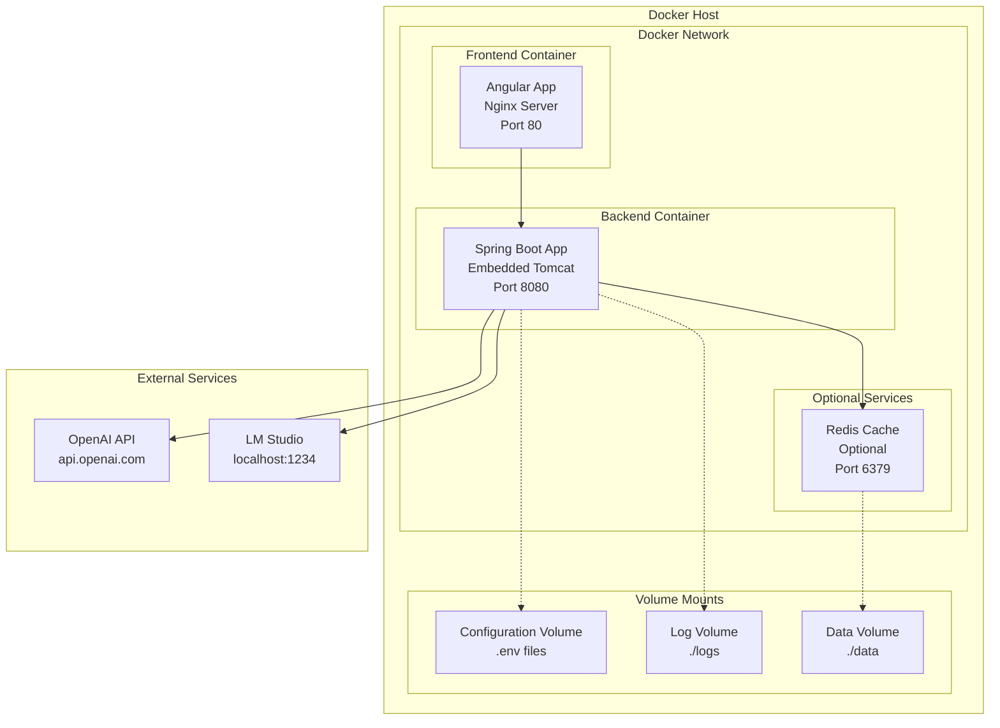

### Kubernetes Deployment Pattern

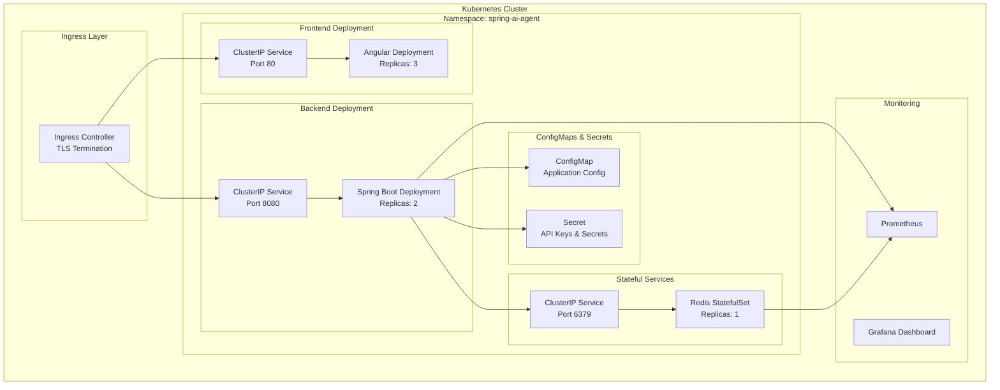

## Performance Considerations

### Concurrent Request Processing

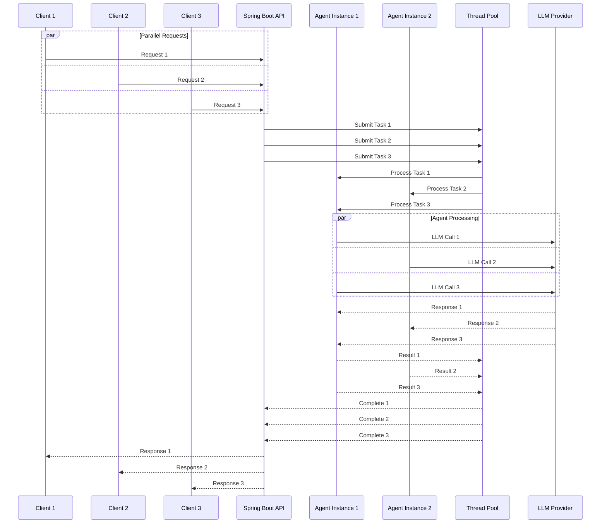

### Memory Management and Garbage Collection

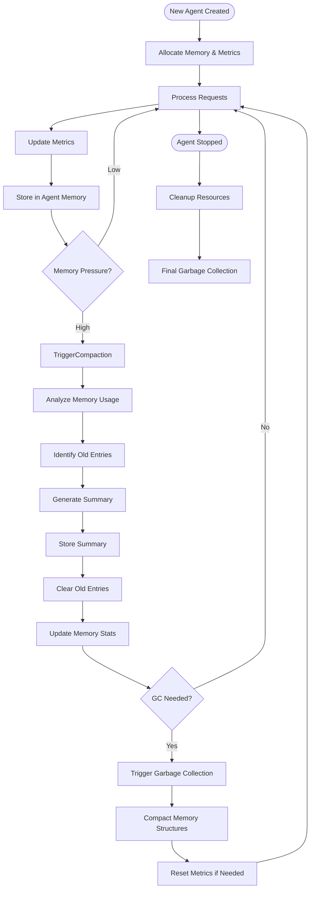

### Caching Strategy

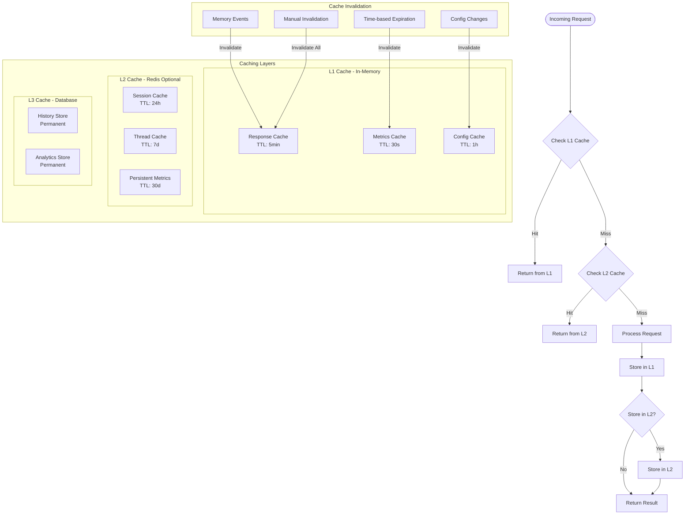

This architecture documentation provides a comprehensive view of the system design, component interactions, and operational patterns. The Mermaid diagrams can be rendered in any Markdown viewer that supports Mermaid, such as GitHub, GitLab, or documentation platforms like MkDocs.