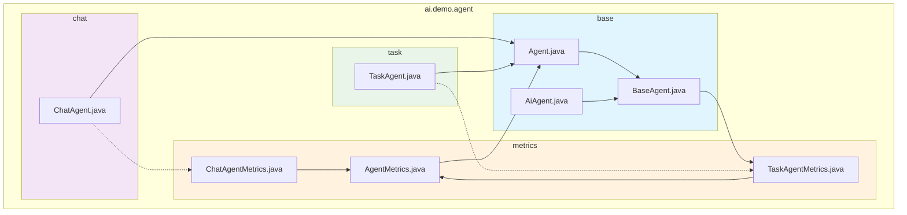

# Package Structure Documentation

This document describes the organized package structure of the Spring AI Agent project.

## Package Organization

```
ai.demo.agent/
├── base/                    # Core abstractions and base implementations
│   ├── Agent.java           # Base agent interface
│   ├── AiAgent.java         # AI/LLM specialization interface
│   ├── BaseAgent.java       # Abstract base implementation
│   ├── AgentConfiguration.java
│   ├── AgentException.java
│   ├── AgentMemory.java
│   ├── AgentState.java
│   └── task/                # Task abstractions
│       ├── Task.java
│       ├── TaskPriority.java
│       ├── TaskStatus.java
│       ├── TaskSize.java
│       └── TaskAttempt.java
│
├── chat/                    # Chat agent specialization
│   └── ChatAgent.java       # Conversational agent interface
│
├── task/                    # Task agent specialization
│   └── TaskAgent.java       # Discrete task processing interface
│
└── metrics/                 # Performance metrics system
    ├── AgentMetrics.java     # Abstract base metrics
    ├── TaskAgentMetrics.java # Task-specific metrics
    └── ChatAgentMetrics.java # Chat-specific metrics
```

## Package Dependencies



## Import Patterns

### Base Classes
```java
import ai.demo.agent.base.Agent;
import ai.demo.agent.base.BaseAgent;
import ai.demo.agent.base.AiAgent;
import ai.demo.agent.base.task.Task;
```

### Specialized Interfaces
```java
import ai.demo.agent.chat.ChatAgent;
import ai.demo.agent.task.TaskAgent;
```

### Metrics System
```java
import ai.demo.agent.metrics.AgentMetrics;
import ai.demo.agent.metrics.TaskAgentMetrics;
import ai.demo.agent.metrics.ChatAgentMetrics;
```

## Package Responsibilities

### `base/` Package
- **Purpose**: Core abstractions and shared functionality
- **Contains**: Base interfaces, abstract implementations, common utilities
- **Key Classes**: `Agent`, `BaseAgent`, `AiAgent`, `AgentMemory`, `AgentState`
- **Dependencies**: Minimal external dependencies

### `chat/` Package
- **Purpose**: Conversational agent specialization
- **Contains**: Chat-specific interfaces and conversation management
- **Key Classes**: `ChatAgent`
- **Dependencies**: `base/` package

### `task/` Package
- **Purpose**: Discrete task processing specialization
- **Contains**: Task-specific interfaces and processing logic
- **Key Classes**: `TaskAgent`
- **Dependencies**: `base/` package, `base/task/` subpackage

### `metrics/` Package
- **Purpose**: Performance monitoring and metrics collection
- **Contains**: Metrics collection classes and performance tracking
- **Key Classes**: `AgentMetrics`, `TaskAgentMetrics`, `ChatAgentMetrics`
- **Dependencies**: `base/` package for task abstractions

## Migration Benefits

1. **Clear Separation of Concerns**: Each package has a single, well-defined responsibility
2. **Improved Discoverability**: Developers can easily find relevant classes
3. **Reduced Coupling**: Specialized packages only import what they need
4. **Better Maintainability**: Changes to one specialization don't affect others
5. **Enhanced Testability**: Each package can be tested independently

## Usage Examples

### Creating a Task Agent
```java
import ai.demo.agent.task.TaskAgent;
import ai.demo.agent.base.BaseAgent;
import ai.demo.agent.base.task.Task;
import ai.demo.agent.metrics.TaskAgentMetrics;

public class MyTaskAgent extends BaseAgent<MyTask, MyResult> implements TaskAgent<MyTask, MyResult> {
    // Implementation
}
```

### Creating a Chat Agent
```java
import ai.demo.agent.chat.ChatAgent;
import ai.demo.agent.base.BaseAgent;
import ai.demo.agent.metrics.ChatAgentMetrics;

public class MyChatAgent extends BaseAgent<ChatRequest, ChatResponse> implements ChatAgent<ChatRequest, ChatResponse> {
    // Implementation
}
```

### Working with Metrics
```java
import ai.demo.agent.metrics.AgentMetrics;
import ai.demo.agent.metrics.TaskAgentMetrics;

AgentMetrics metrics = agent.getMetrics();
if (metrics instanceof TaskAgentMetrics taskMetrics) {
    // Use task-specific metrics
    long tasksProcessed = taskMetrics.getTasksProcessed();
}
```