# Technical Design Documentation

This document provides deep technical details about the Spring AI Agent project's design patterns, algorithms, and implementation details.

## Table of Contents
1. [Agent Framework Internals](#agent-framework-internals)
2. [Metrics System Design](#metrics-system-design)
3. [Memory Management Architecture](#memory-management-architecture)
4. [State Machine Implementation](#state-machine-implementation)
5. [Thread Safety and Concurrency](#thread-safety-and-concurrency)
6. [Performance Optimization](#performance-optimization)

## Agent Framework Internals

### Template Method Pattern Implementation

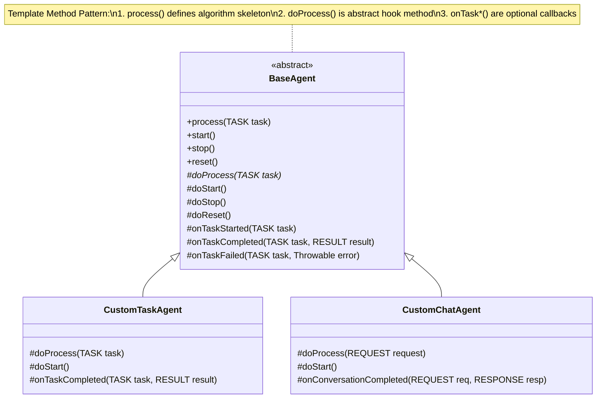

### Agent Lifecycle Algorithm

```mermaid
flowchart TD
    Start([Agent Created]) --> CreatedState{State: CREATED}

    CreatedState -->|start()| StartTransition[Transition: STARTING]
    StartTransition --> DoStart[Call doStart()]
    DoStart --> StartSuccess{Success?}
    StartSuccess -->|Yes| StartedState{State: STARTED}
    StartSuccess -->|No| ErrorState{State: ERROR}

    StartedState -->|process()| ProcessRequest[Process Request]
    ProcessRequest --> CheckRunning{Is Running?}
    CheckRunning -->|Yes| ExecuteTask[Execute Task]
    CheckRunning -->|No| RejectRequest[Reject Request]

    ExecuteTask --> RecordStart[Record Start Metrics]
    RecordStart --> DoProcess[Call doProcess()]
    DoProcess --> ProcessResult{Process Result}
    ProcessResult -->|Success| RecordSuccess[Record Success Metrics]
    ProcessResult -->|Failure| RecordFailure[Record Failure Metrics]

    RecordSuccess --> CallbackSuccess[Call onTaskCompleted]
    RecordFailure --> CallbackFailure[Call onTaskFailed]

    CallbackSuccess --> ReturnResult[Return Result]
    CallbackFailure --> ThrowException[Throw Exception]

    StartedState -->|pause()| PauseTransition[Transition: PAUSING]
    PauseTransition --> DoPause[Call doPause()]
    DoPause --> PausedState{State: PAUSED}

    PausedState -->|stop()| StopTransition[Transition: STOPPING]
    StartedState -->|stop()| StopTransition
    StopTransition --> DoStop[Call doStop()]
    DoStop --> StoppedState{State: STOPPED}

    ErrorState -->|reset()| ResetTransition[Transition: RESETTING]
    PausedState -->|reset()| ResetTransition
    StoppedState -->|reset()| ResetTransition
    ResetTransition --> DoReset[Call doReset()]
    DoReset --> ResetMetrics[Reset Metrics]
    DoReset --> ClearMemory[Clear Memory]
    ResetMetrics --> CreatedState
    ClearMemory --> CreatedState
```

### Agent Factory Pattern

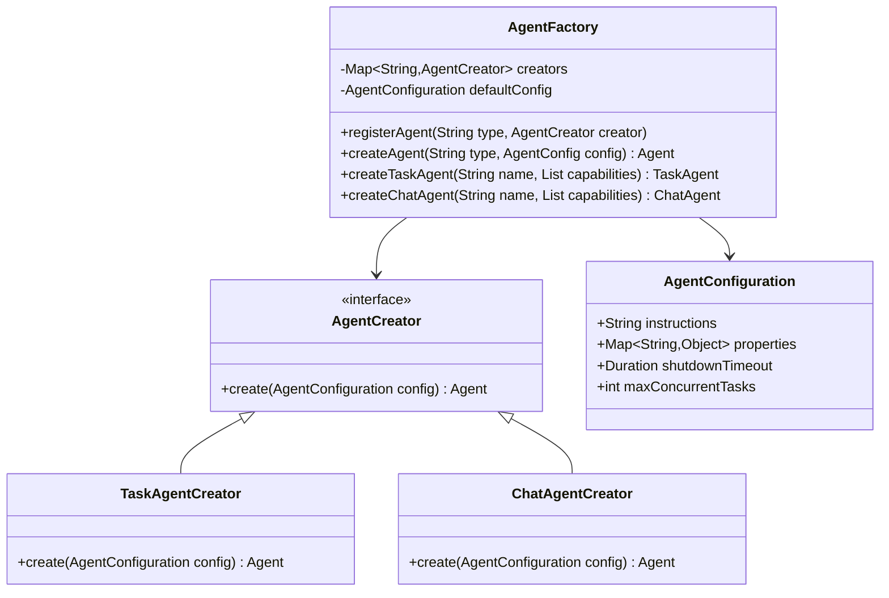

## Metrics System Design

### Metrics Collection Architecture

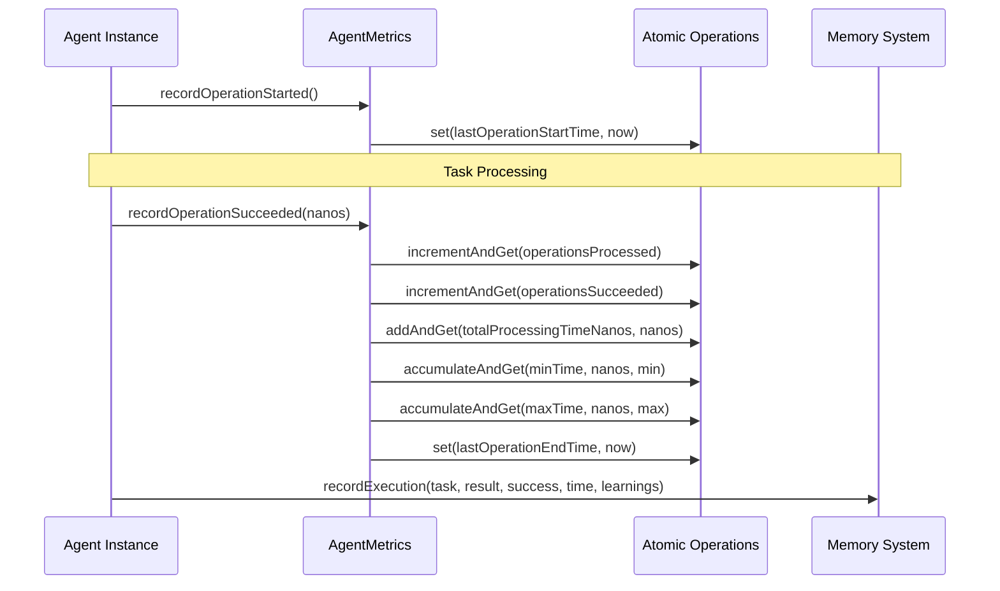

### Metrics Calculation Algorithms

```mermaid
flowchart TD
    MetricsRequest([Get Metrics Request]) --> CalculateBasic[Calculate Basic Metrics]

    CalculateBasic --> TotalOps[Total Operations = processed.get()]
    CalculateBasic --> SuccessRate[Success Rate = succeeded/processed]
    CalculateBasic --> FailureRate[Failure Rate = failed/processed]
    CalculateBasic --> Throughput[Throughput = processed/uptime_seconds]

    TotalOps --> CheckTaskMetrics{TaskAgentMetrics?}
    SuccessRate --> CheckTaskMetrics
    FailureRate --> CheckTaskMetrics
    Throughput --> CheckTaskMetrics

    CheckTaskMetrics -->|Yes| CalculateTaskMetrics
    CheckTaskMetrics -->|No| CheckChatMetrics{ChatAgentMetrics?}

    CalculateTaskMetrics --> TaskSuccessRate[Task Success Rate]
    CalculateTaskMetrics --> RetryRate[Retry Rate]
    CalculateTaskMetrics --> AverageInputSize[Average Input Size]
    CalculateTaskMetrics --> AverageOutputSize[Average Output Size]
    CalculateTaskMetrics --> PriorityDistribution[Priority Distribution]

    CheckChatMetrics -->|Yes| CalculateChatMetrics
    CheckChatMetrics -->|No| BuildSummary[Build Metrics Summary]

    CalculateChatMetrics --> ConversationMetrics[Conversation Metrics]
    CalculateChatMetrics --> MessageMetrics[Message Metrics]
    CalculateChatMetrics --> TokenMetrics[Token Metrics]

    TaskSuccessRate --> BuildSummary
    RetryRate --> BuildSummary
    AverageInputSize --> BuildSummary
    ConversationMetrics --> BuildSummary
    MessageMetrics --> BuildSummary
    TokenMetrics --> BuildSummary

    BuildSummary --> ReturnSummary[Return Formatted Summary]
```

### High-Performance Metrics Implementation

```java
// Atomic operations for thread safety
private final AtomicLong operationsProcessed = new AtomicLong(0);
private final AtomicLong totalProcessingTimeNanos = new AtomicLong(0);
private final AtomicLong minProcessingTimeNanos = new AtomicLong(Long.MAX_VALUE);
private final AtomicLong maxProcessingTimeNanos = new AtomicLong(0);

// Lock-free calculation of derived metrics
public double getSuccessRate() {
    long total = operationsProcessed.get();
    long succeeded = operationsSucceeded.get();
    return total > 0 ? (double) succeeded / total : 0.0;
}

// Memory-efficient rolling statistics
public Duration getAverageProcessingTime() {
    long total = operationsProcessed.get();
    if (total > 0) {
        long avgNanos = totalProcessingTimeNanos.get() / total;
        return Duration.ofNanos(avgNanos);
    }
    return Duration.ZERO;
}
```

## Memory Management Architecture

### Memory Compaction Algorithm

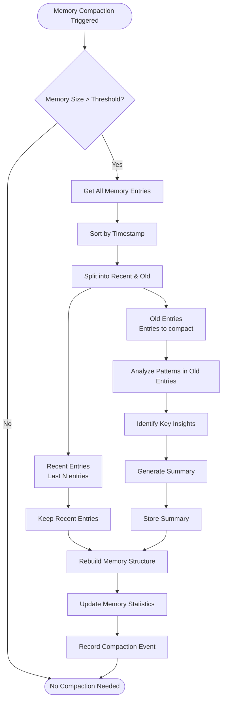

### Memory Storage Structure

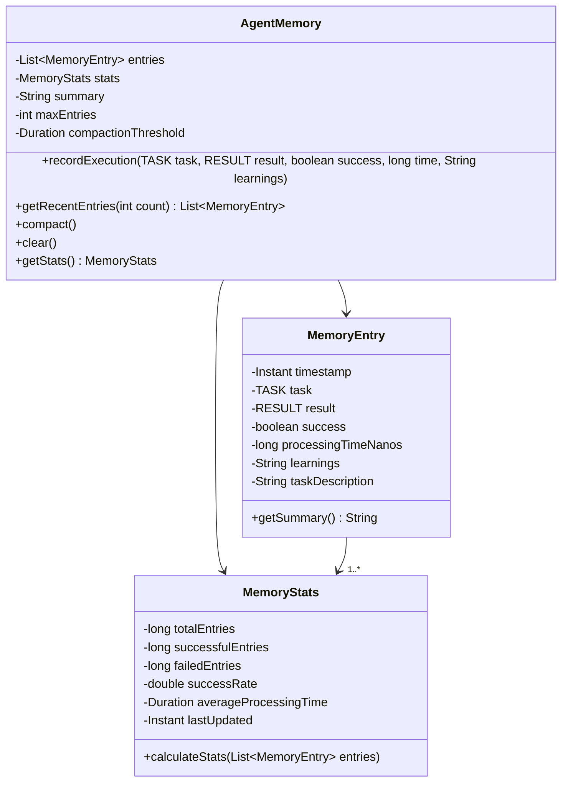

### Learning and Adaptation Algorithm

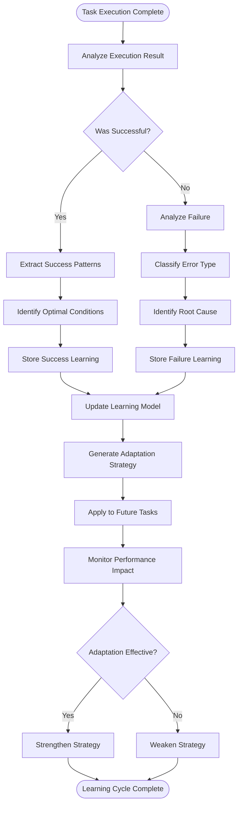

## State Machine Implementation

### Thread-Safe State Transitions

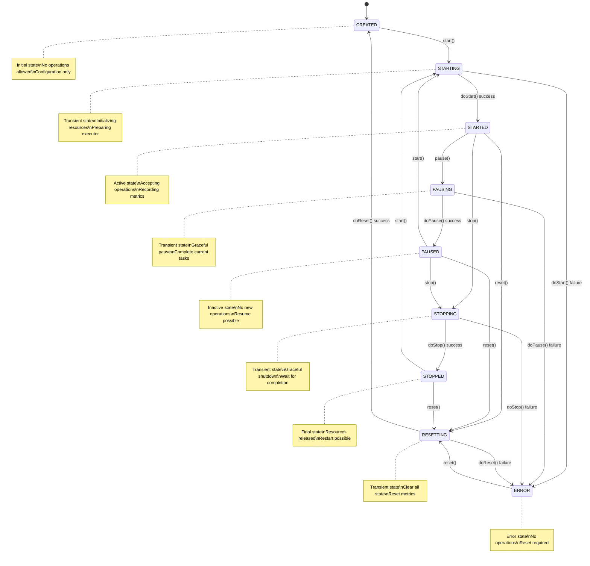

### State Transition Implementation

```java
public enum AgentState {
    CREATED, STARTING, STARTED, PAUSING, PAUSED,
    STOPPING, STOPPED, RESETTING, ERROR;

    public boolean canTransitionTo(AgentState targetState) {
        return switch (this) {
            case CREATED -> targetState == STARTING || targetState == RESETTING;
            case STARTING -> targetState == STARTED || targetState == ERROR;
            case STARTED -> targetState == PAUSING || targetState == STOPPING || targetState == RESETTING;
            case PAUSING -> targetState == PAUSED || targetState == ERROR;
            case PAUSED -> targetState == STARTING || targetState == STOPPING || targetState == RESETTING;
            case STOPPING -> targetState == STOPPED || targetState == ERROR;
            case STOPPED -> targetState == STARTING || targetState == RESETTING;
            case RESETTING -> targetState == CREATED || targetState == ERROR;
            case ERROR -> targetState == RESETTING;
        };
    }
}
```

## Thread Safety and Concurrency

### Single-Threaded Execution Model

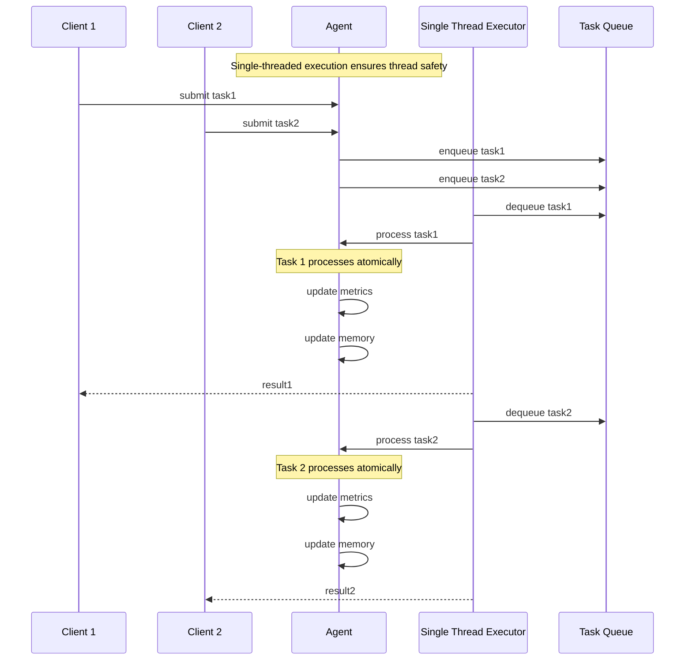

### Atomic Operations Implementation

```java
// Thread-safe metrics collection
public class AgentMetrics {
    private final AtomicLong operationsProcessed = new AtomicLong(0);
    private final AtomicReference<Instant> lastOperationTime = new AtomicReference<>();

    // Lock-free increment operation
    public void recordOperationSucceeded(long processingTimeNanos) {
        operationsProcessed.incrementAndGet();
        totalProcessingTimeNanos.addAndGet(processingTimeNanos);
        lastOperationTime.set(Instant.now());
        updateMinMaxProcessingTime(processingTimeNanos);
    }

    // Atomic min/max update
    private void updateMinMaxProcessingTime(long processingTimeNanos) {
        minProcessingTimeNanos.accumulateAndGet(processingTimeNanos, Math::min);
        maxProcessingTimeNanos.accumulateAndGet(processingTimeNanos, Math::max);
    }
}
```

### Memory Consistency Model

```mermaid
graph TB
    subgraph "Thread 1 - Agent Thread"
        T1_Op1[Operation 1]
        T1_Op2[Update Metrics]
        T1_Op3[Update Memory]
        T1_Op4[Publish Events]
    end

    subgraph "Thread 2 - Metrics Reader"
        T2_Read1[Read Metrics]
        T2_Read2[Read Memory]
        T2_Read3[Calculate Stats]
    end

    subgraph "Thread 3 - API Thread"
        T3_API1[HTTP Request]
        T3_API2[Get Agent State]
        T3_API3[Return Response]
    end

    T1_Op1 --> T1_Op2
    T1_Op2 --> T1_Op3
    T1_Op3 --> T1_Op4

    T1_Op4 -.->|happens-before| T2_Read1
    T1_Op3 -.->|happens-before| T2_Read2

    T2_Read1 --> T2_Read2
    T2_Read2 --> T2_Read3

    T2_Read3 -.->|happens-before| T3_API2
    T3_API1 --> T3_API2
    T3_API2 --> T3_API3

    note right of T1_Op4 "AtomicLong & AtomicReference\nprovide visibility guarantees"
    note right of T2_Read3 "Volatile reads ensure\nlatest values visible"
```

## Performance Optimization

### Lazy Loading and Caching

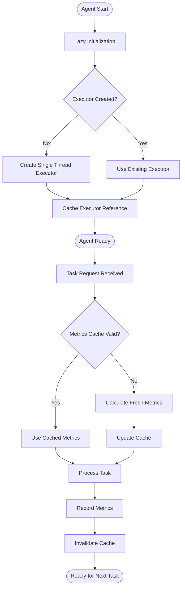

### Memory Pool Pattern for Task Processing

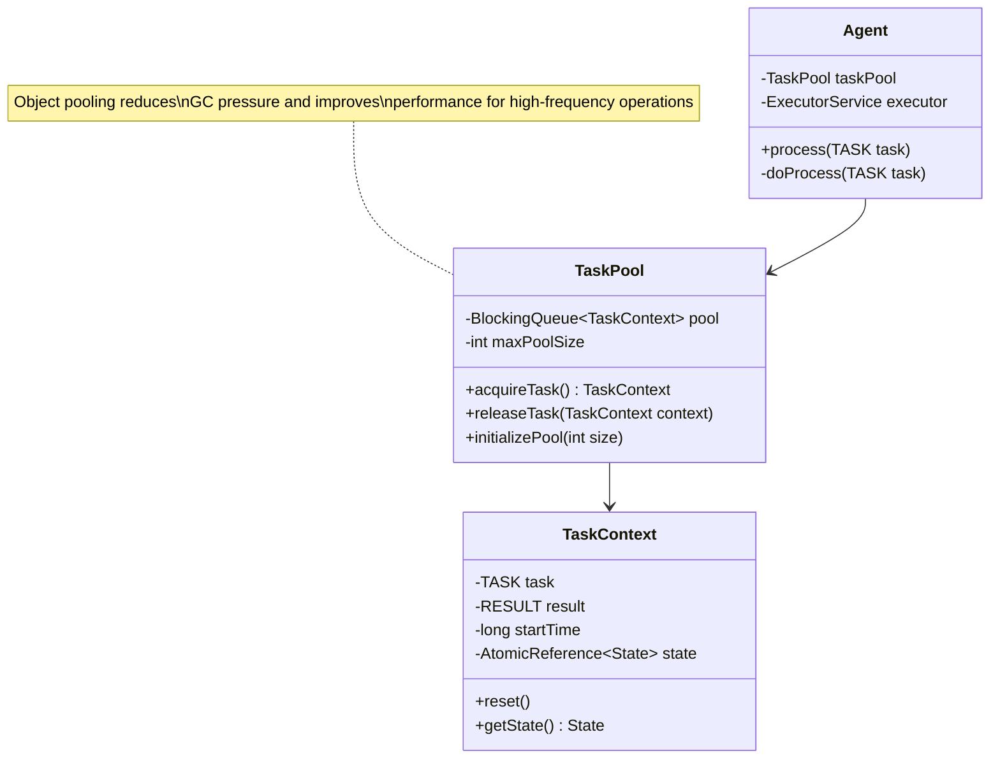

### Batch Processing Optimization

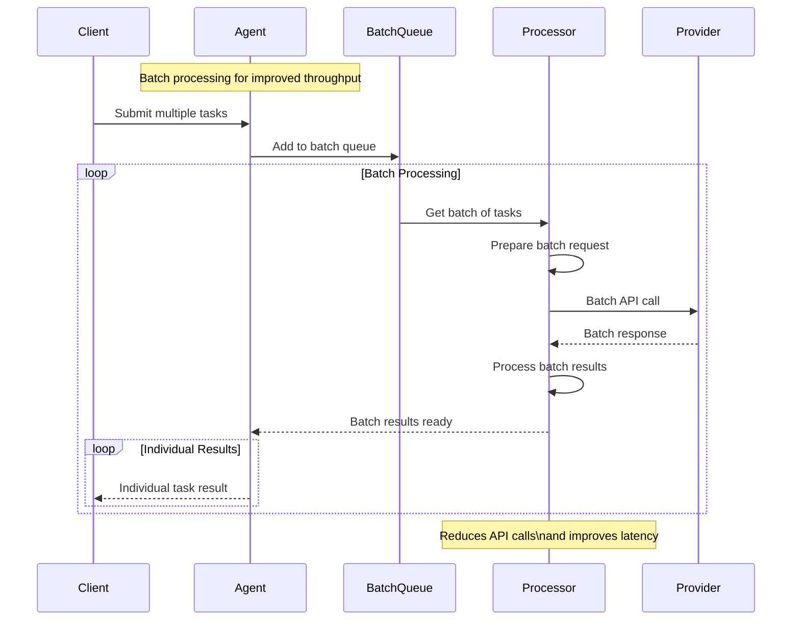

This technical design documentation provides deep insights into the implementation details, algorithms, and optimization strategies used throughout the Spring AI Agent project. The patterns and approaches described here can serve as a reference for developers working on extending or maintaining the system.